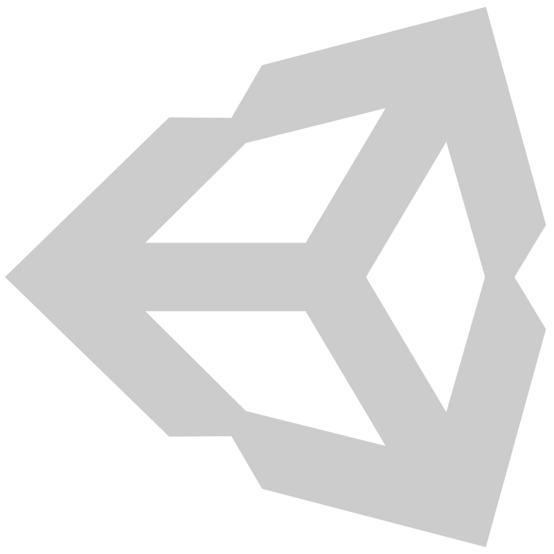
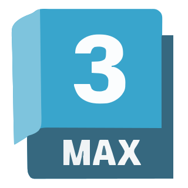

 

  

---

<h2 align="center">🎮 About Me</h2>

Computer Engineer passionate about creating video game experiences.

I enjoy combining programming and digital art to build immersive environments,
gameplay systems, shaders, editor tools and polished player experiences.

Currently looking for opportunities as:

🎨 Technical Artist

🎮 Game Designer

💻 Unity Developer

---

<h2 align="center">⚡ Tech Stack</h2>

---

<h2 align="center">🕹 What I Love Building</h2>

<table align="center">

<tr>

<td align="center" width="180">

🌎

 

Environment Art

</td>

<td align="center" width="180">

🎮

 

Gameplay Systems

</td>

<td align="center" width="180">

🎨

 

Technical Art

</td>

<td align="center" width="180">

⚡

 

Unity Tools

</td>

</tr>

</table>

---

<h2 align="center">📊 GitHub Stats</h2>

 

---

<h2 align="center">🌌 Visitor Counter</h2>

---

<h2 align="center">🌐 Connect With Me</h2>

 

  

